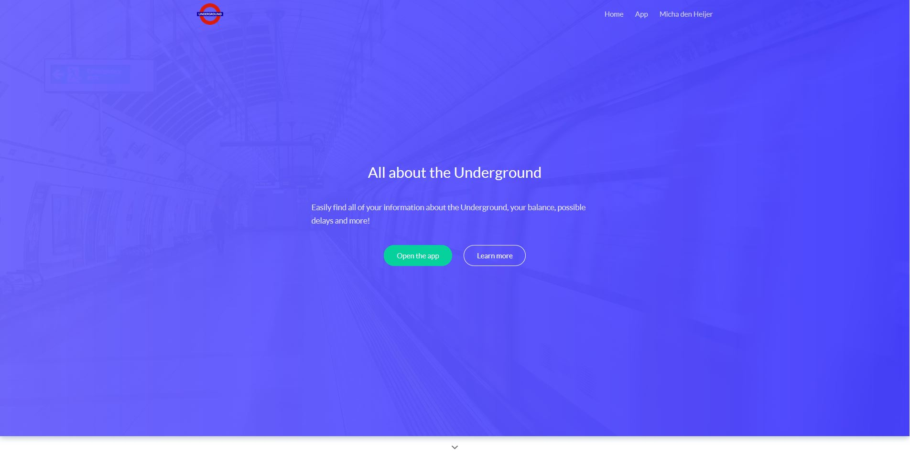
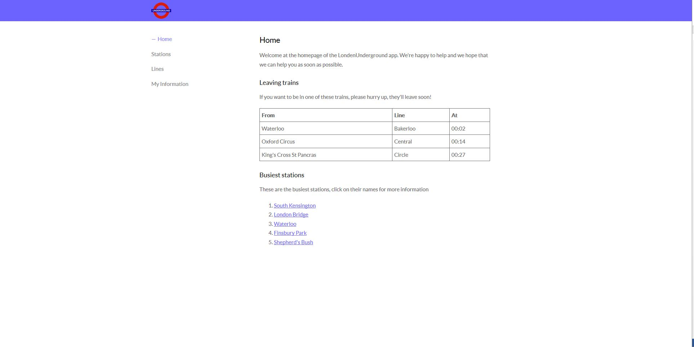
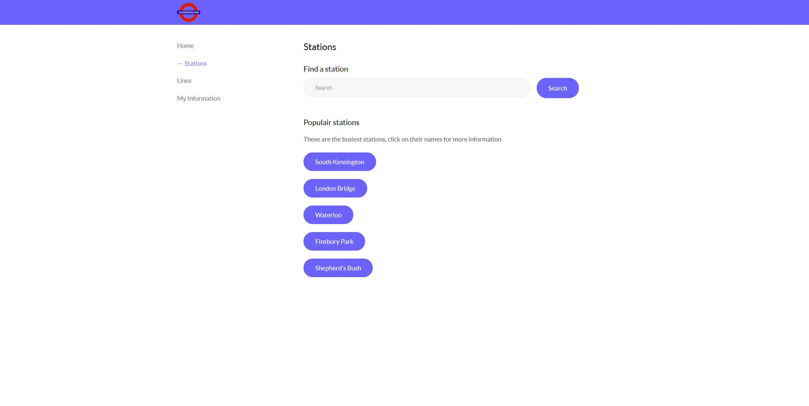
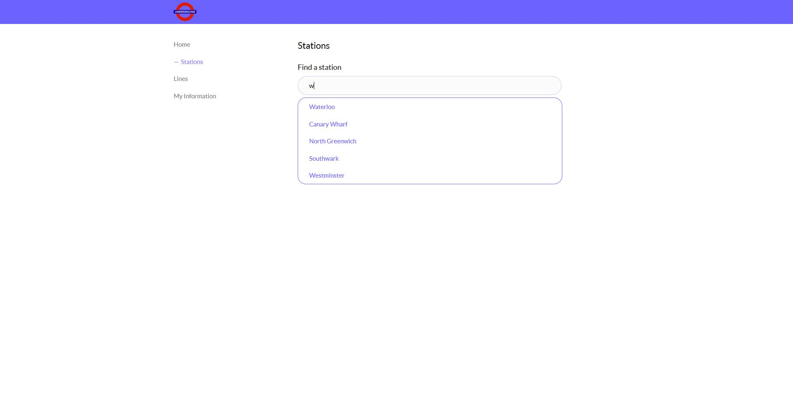
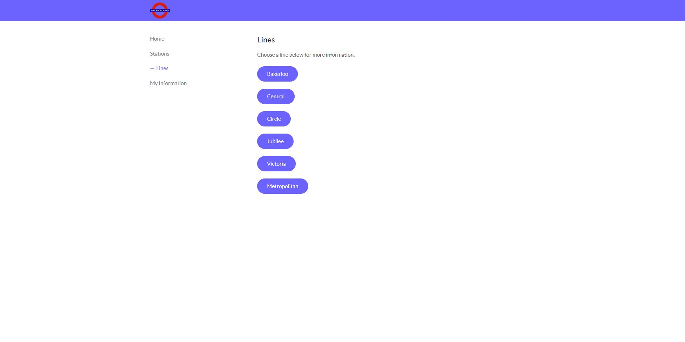
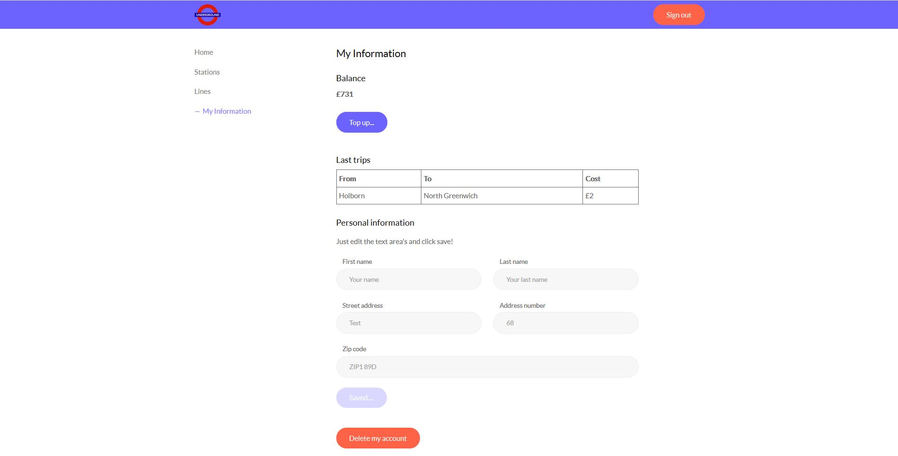

# not-php
This is a database with webapp, that can search the Londen Underground for prices, your journeys and what your balance is. It's just a schoolproject so the data is not real. As database I have mysql, communication between the server and the browser are done using socket.io. All made using the [Evie theme](https://evie.undraw.co/) by Undraw.

## Screenshots

## npm plugins
socket.io
express
compression
pm2
node-mysql

## database
mysql